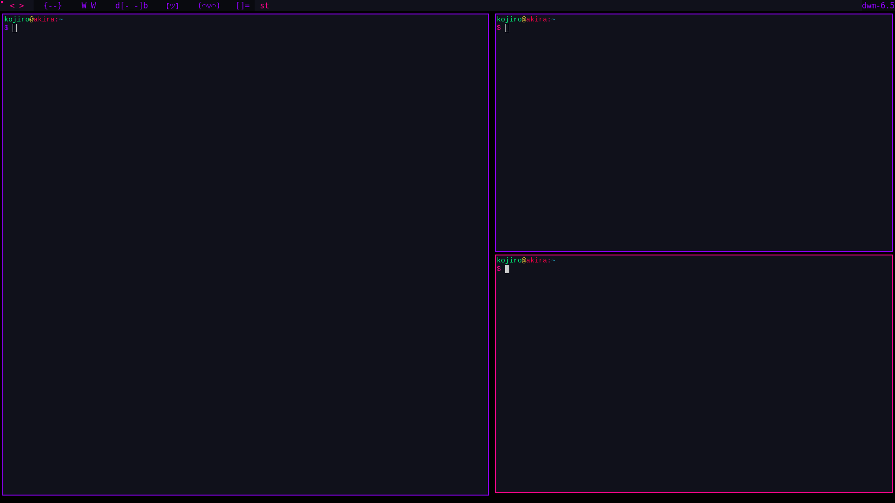

# Blossom Theme for DWM

## Preview



## Installation
1. Clone the repository.
```git clone https://github.com/BlossomTheme/DWM.git```

2. Navigate to the repository.
```cd ./DWM```

3. Install.
```sudo make install```

4. Enjoy!